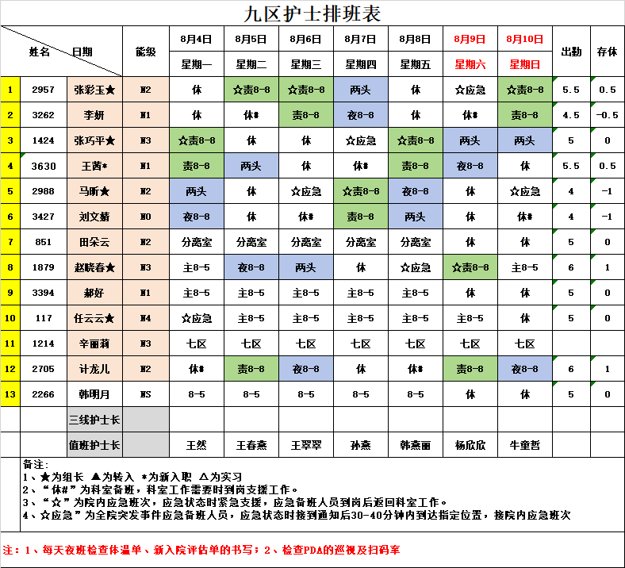

# 护士排班工具

通过使用该工具，您可以将排班截图上传到工具，工具会解析排班信息，将其转为日历形式，并提供下载功能。下载为 ics格式的文件，方便导入到日历应用中。

除了排班信息的解析和转换，工具还提供了一个简单的前端界面，用户可以在其中上传图片并查看转换后的日历。

持续更新中，欢迎提出建议和意见。

## 使用方法

首先说明一下，目前该工具支持的截图识别可能不适用于所有医院，后期看情况陆续支持更多医院的排班截图。目前的截图如下：



解析出来的json格式数据如下：

```json
{
    "nurses": [
        {
            "id": 1,
            "name": "张彩玉★",
            "level": "M2",
            "schedule": {
                "8月4日": "休",
                "8月5日": "责8-8",
                "8月6日": "责8-8",
                "8月7日": "两头",
                "8月8日": "休",
                "8月9日": "应急",
                "8月10日": "责8-8"
            },
            "attendance": 5.5,
            "rest": 0.5
        },
        {
            "id": 2,
            "name": "李妍",
            "level": "H1",
            "schedule": {
                "8月4日": "休",
                "8月5日": "休#",
                "8月6日": "责8-8",
                "8月7日": "夜8-8",
                "8月8日": "休",
                "8月9日": "休#",
                "8月10日": "责8-8"
            },
            "attendance": 4.5,
            "rest": -0.5
        },
        {
            "id": 3,
            "name": "张巧平★",
            "level": "H3",
            "schedule": {
                "8月4日": "壹8-8",
                "8月5日": "休",
                "8月6日": "休",
                "8月7日": "应急",
                "8月8日": "责8-8",
                "8月9日": "两头",
                "8月10日": "两头"
            },
            "attendance": 5,
            "rest": 0
        },
        {
            "id": 4,
            "name": "王茜*",
            "level": "M1",
            "schedule": {
                "8月4日": "责8-8",
                "8月5日": "两头",
                "8月6日": "休",
                "8月7日": "休*",
                "8月8日": "责8-8",
                "8月9日": "夜8-8",
                "8月10日": "休"
            },
            "attendance": 5.5,
            "rest": 0.5
        },
        {
            "id": 5,
            "name": "马听★",
            "level": "M2",
            "schedule": {
                "8月4日": "两头",
                "8月5日": "休",
                "8月6日": "应急",
                "8月7日": "责8-8",
                "8月8日": "夜8-8",
                "8月9日": "休",
                "8月10日": "应急"
            },
            "attendance": 4,
            "rest": -1
        },
        {
            "id": 6,
            "name": "刘文婧",
            "level": "NO",
            "schedule": {
                "8月4日": "夜8-8",
                "8月5日": "休",
                "8月6日": "休*",
                "8月7日": "责8-8",
                "8月8日": "两头",
                "8月9日": "休",
                "8月10日": "休#"
            },
            "attendance": 4,
            "rest": -1
        },
        {
            "id": 7,
            "name": "田朵云",
            "level": "M2",
            "schedule": {
                "8月4日": "分离室",
                "8月5日": "分离室",
                "8月6日": "分离室",
                "8月7日": "分离室",
                "8月8日": "分离室",
                "8月9日": "休",
                "8月10日": "休"
            },
            "attendance": 5,
            "rest": 0
        },
        {
            "id": 8,
            "name": "赵晓春★",
            "level": "M3",
            "schedule": {
                "8月4日": "主8-5",
                "8月5日": "夜8-8",
                "8月6日": "两头",
                "8月7日": "休",
                "8月8日": "应急",
                "8月9日": "责8-8",
                "8月10日": "主8-5"
            },
            "attendance": 6,
            "rest": 1
        },
        {
            "id": 9,
            "name": "郝好",
            "level": "H1",
            "schedule": {
                "8月4日": "主8-5",
                "8月5日": "主8-5",
                "8月6日": "主8-5",
                "8月7日": "主8-5",
                "8月8日": "主8-5",
                "8月9日": "休",
                "8月10日": "休"
            },
            "attendance": 5,
            "rest": 0
        },
        {
            "id": 10,
            "name": "任云云★",
            "level": "H4",
            "schedule": {
                "8月4日": "应急",
                "8月5日": "主8-5",
                "8月6日": "主8-5",
                "8月7日": "主8-5",
                "8月8日": "主8-5",
                "8月9日": "主8-5",
                "8月10日": "休"
            },
            "attendance": 5,
            "rest": 0
        },
        {
            "id": 11,
            "name": "辛丽莉",
            "level": "H3",
            "schedule": {
                "8月4日": "七区",
                "8月5日": "七区",
                "8月6日": "七区",
                "8月7日": "七区",
                "8月8日": "七区",
                "8月9日": "七区",
                "8月10日": "七区"
            },
            "attendance": null,
            "rest": null
        },
        {
            "id": 12,
            "name": "计龙儿",
            "level": "H2",
            "schedule": {
                "8月4日": "休#",
                "8月5日": "责8-8",
                "8月6日": "夜8-8",
                "8月7日": "休",
                "8月8日": "休*",
                "8月9日": "责8-8",
                "8月10日": "夜8-8"
            },
            "attendance": 6,
            "rest": 1
        },
        {
            "id": 13,
            "name": "韩明月",
            "level": "NS",
            "schedule": {
                "8月4日": "8-5",
                "8月5日": "8-5",
                "8月6日": "8-5",
                "8月7日": "8-5",
                "8月8日": "8-5",
                "8月9日": "休",
                "8月10日": "体"
            },
            "attendance": 5,
            "rest": 0
        }
    ],
    "headNurses": {
        "三线护士长": "",
        "值班护士长": {
            "8月4日": "王然",
            "8月5日": "王春熹",
            "8月6日": "王翠翠",
            "8月7日": "孙燕",
            "8月8日": "韩燕丽",
            "8月9日": "杨欣欣",
            "8月10日": "牛重哲"
        }
    },
    "notes": [
        "1、★为组长 ▲为转入*为新入职 △为实习",
        "2、“体#”为科室备班，科室工作需要时到岗支援工作。",
        "3、“★”为院内应急班次，应急状态时紧急支援，应急备班人员到岗后返回科室工作。",
        "4、“★应急”为全院突发事件应急备班人员，应急状态时接到通知后30-40分钟内到达指定位置，接院内应急班次",
        "1、每天夜班检查体温单、新入院评估单的书写；2、检查PDA的巡视及扫码率"
    ]
}
```

目前将上面解析出来的 json 数据转为 ics 格式的文件使用的是 python 脚本来实现，代码为项目根目录下 python-script 文件下的内容，里面包含了python脚本和测试json文件，以及最终生成的效果。

持续更新中……

## 技术栈

- 服务端：SpringBoot 4.0、Java 24


## 第三方API

该工具的图片解析功能使用到了第三方 OCR 大模型解析，使用的是 讯飞的 OCR 接口。具体使用方法请参考 [讯飞开放平台](https://www.xfyun.cn/services/ocr_model) 的文档。

## 启动

### 配置环境变量

在启动前，请确保配置了以下运行参数（Idea中配置）：

- `XF_ID`: 讯飞开放平台的应用 ID
- `XF_KEY`: 讯飞开放平台的应用密钥
- `XF_SECRET`: 讯飞开放平台的应用密钥
